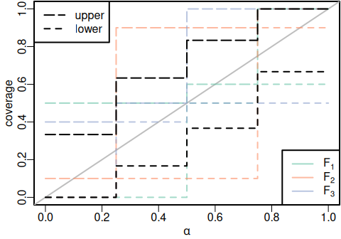
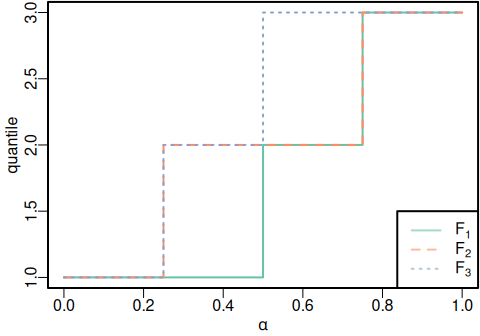

Illustrative example
================

We start by loading the functions implementing example generation,
linear constraints and some visualizations (and some packages required
by the functions).

``` r
source("functions.R")
```

As in Appendix B of the manuscript, we use Example 2.4 (b) from Gneiting
and Resin (2023) to illustrate some of the workings of these functions.

We start by fixing the number of classes $k$ and the denominator $n$ to
generate the forecast probabilities. Note that *all* probabilities are
represented as multiples of $1/n$ in what follows.

``` r
k = 3 # number of classes
n = 4 # common denominator of all forecast probabilities

f = generate_forecasts(k,n)
f
```

    ##   [,1] [,2] [,3]
    ## 1    2    1    1
    ## 2    1    2    1
    ## 3    1    1    2

Here, each *column* represents a predictive pmf, i.e., $$
  \texttt{f[i,j]} = f_j(i).
$$ We assume throughout that forecasts are equiprobable ($p_j = 1/N$).
We now construct the systems of linear equations encoding particular
notions of calibration such as marginal or probabilistic calibration. We
can combine them and test, whether the particular solution,
$\texttt{sle\$f}$, in fact satisfies the system.

``` r
sle_MC = construct_sle_MC(k,n,f)
sle_PC = construct_sle_PC(k,n,f)

test_sle(sle_MC)
```

    ## [1] TRUE

``` r
test_sle(sle_PC)
```

    ## [1] TRUE

``` r
sle = combine_sle(sle_MC,sle_PC)

test_sle(sle)
```

    ## [1] TRUE

``` r
sle
```

    ## $A
    ##       [,1] [,2] [,3] [,4] [,5] [,6] [,7] [,8] [,9]
    ##  [1,]  1.0    0    0    1  0.0    0    1    0  0.0
    ##  [2,]  0.0    1    0    0  1.0    0    0    1  0.0
    ##  [3,]  0.0    0    1    0  0.0    1    0    0  1.0
    ##  [4,]  1.0    1    1    0  0.0    0    0    0  0.0
    ##  [5,]  0.0    0    0    1  1.0    1    0    0  0.0
    ##  [6,]  0.0    0    0    0  0.0    0    1    1  1.0
    ##  [7,]  1.0    0    0    1  0.0    0    1    0  0.0
    ##  [8,]  0.0    1    0    0  1.0    0    0    1  0.0
    ##  [9,]  0.0    0    1    0  0.0    1    0    0  1.0
    ## [10,]  0.5    1    1    0  0.0    0    0    0  0.0
    ## [11,]  1.0    1    1    0  0.5    1    0    0  0.0
    ## [12,]  1.0    1    1    1  1.0    1    0    0  0.5
    ## 
    ## $b
    ##       1 2 3             
    ## 4 4 4 4 4 4 4 4 4 3 6 9 
    ## 
    ## $f
    ## [1] 2 1 1 1 2 1 1 1 2

Note that each system also contains the constraints that ensure that
probabilities sum to one (equations 1–3 and 7–9) and the linear
equations for the particular notions have been multiplied by
$1/p_j = N$.

We compute the homogeneous solution to the linear system and use this to
construct any other particular solution.

``` r
g_part = sle$f
g_hom = solve_hom(sle)

c = -0.6 # in [-1,1] for (multiples of) probabilities
g = matrix(g_part + g_hom %*% c,nrow = k,byrow = TRUE)
g
```

    ##      [,1] [,2] [,3]
    ## [1,]  2.0  0.4  1.6
    ## [2,]  0.4  3.2  0.4
    ## [3,]  1.6  0.4  2.0

Thus, we recovered Example 2.4 (b) from Gneiting and Resin (2023).

``` r
fractions(cbind(t(f)/n,t(g)/n))
```

    ##      1    2    3                  
    ## [1,]  1/2  1/4  1/4  1/2 1/10  2/5
    ## [2,]  1/4  1/2  1/4 1/10  4/5 1/10
    ## [3,]  1/4  1/4  1/2  2/5 1/10  1/2

We can verify/falsify other notions by constructing the corresponding
linear systems and testing whether these are satisfied by the solution
$\texttt{g}$.

The example is CEP calibrated (CC) but not fully CEP calibrated (fCC):

``` r
sle_CC = construct_sle_CC(k,n,f)
test_sle(sle_CC,g)
```

    ## [1] TRUE

``` r
sle_fCC = construct_sle_fCC(k,n,f)
test_sle(sle_fCC,g)
```

    ## [1] FALSE

The example is threshold calibrated (TC) but not fully threshold
calibrated (fTC):

``` r
sle_TC = construct_sle_TC(k,n,f)
test_sle(sle_TC,g)
```

    ## [1] TRUE

``` r
sle_fTC = construct_sle_fTC(k,n,f)
test_sle(sle_fTC,g)
```

    ## [1] FALSE

The example is not average probabilistically calibrated (aPC):

``` r
sle_aPC = construct_sle_aPC(k,n,f)
test_sle(sle_aPC,g)
```

    ## [1] FALSE

The example is not class-wise calibrated (CwC):

``` r
sle_CwC = construct_sle_CwC(k,n,f)
test_sle(sle_CwC,g)
```

    ## [1] FALSE

A quick simultaneous assessment of all implemented notions from Table 4
can be run via:

``` r
test_all(k,n,f,g)
```

    ##        CwC   MC   fCC  pCC   fPC  pPC   aPC   fTC  pTC
    ## [1,] FALSE TRUE FALSE TRUE FALSE TRUE FALSE FALSE TRUE

To assess quantile calibration, we plot conditional coverages and
predictive quantiles:

``` r
plot_QC(k,n,f,g)
```

<!-- --><!-- -->
